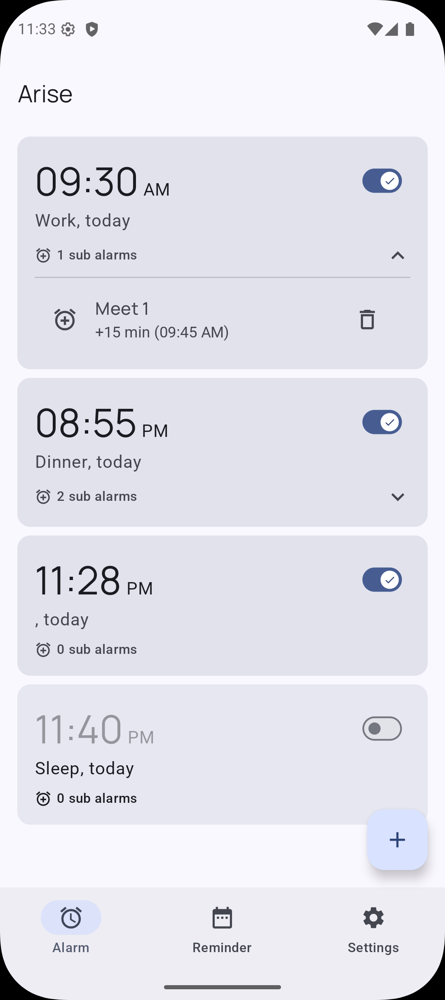
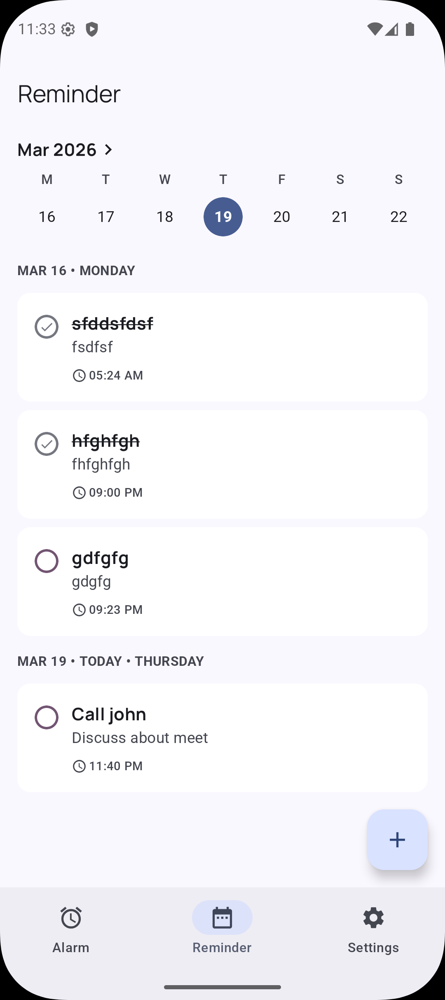
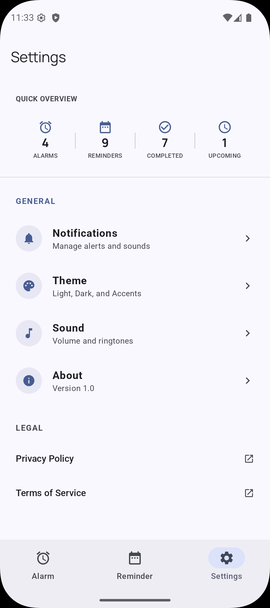

# Arise

A modern Android alarm & reminder app — set alarms with sub-alarms, manage reminders, and stay on schedule.

## Features

### Alarms
- **Sub-Alarms** — Add multiple reminder notifications that fire at custom intervals before the main alarm
- **Repeating Schedules** — Set alarms to repeat on specific days of the week
- **Alarm Toggle** — Enable or disable alarms without deleting them
- **Snooze & Dismiss** — Snooze alarms for 5 minutes or dismiss from the lock screen
- **Full-Screen Notifications** — Lock screen alarm UI with sound and vibration
- **Boot Persistence** — Alarms are automatically rescheduled after device reboot

### Reminders
- **Quick Reminders** — Create reminders with title, description, and date/time
- **Repeating Reminders** — Set reminders to repeat on specific days
- **Calendar View** — Week calendar strip with date picker for easy scheduling
- **Mark as Completed** — Toggle reminder completion status

### Navigation
- **Bottom Navigation** — Quick access to Alarms, Reminders, and Settings tabs

## Screenshots

<p align="center">
  
  
  
</p>

## Tech Stack

- **Language**: Kotlin
- **UI**: Jetpack Compose + Material 3
- **Architecture**: Clean Architecture (Presentation / Domain / Data)
- **Database**: Room
- **DI**: Hilt
- **Navigation**: Jetpack Navigation Compose
- **Async**: Kotlin Coroutines & Flow

## Requirements

- Android 7.0 (API 24) or higher
- Android Studio Ladybug or later

## Building

1. Clone the repository:
   ```bash
   git clone https://github.com/Tobibur/SubAlarm.git
   ```

2. Open the project in Android Studio.

3. Sync Gradle and run on a device or emulator.

## Architecture

```
com.tobibur.arise/
├── alarm/          # Alarm triggering, receivers, and services
├── reminder/       # Reminder notification receivers
├── data/           # Room database, DAOs, entities, and mappers
├── di/             # Hilt dependency injection modules
├── domain/         # Models, repository interfaces, and use cases
├── presentation/   # Compose screens, viewmodels, and components
└── ui/theme/       # Material 3 theme configuration
```

## Contributing

Contributions are welcome! Please open an issue first to discuss what you'd like to change.

1. Fork the repository
2. Create your feature branch (`git checkout -b feature/my-feature`)
3. Commit your changes
4. Push to the branch (`git push origin feature/my-feature`)
5. Open a Pull Request

## License

```
Copyright 2025 Tobibur

Licensed under the Apache License, Version 2.0 (the "License");
you may not use this file except in compliance with the License.
You may obtain a copy of the License at

    http://www.apache.org/licenses/LICENSE-2.0

Unless required by applicable law or agreed to in writing, software
distributed under the License is distributed on an "AS IS" BASIS,
WITHOUT WARRANTIES OR CONDITIONS OF ANY KIND, either express or implied.
See the License for the specific language governing permissions and
limitations under the License.
```
